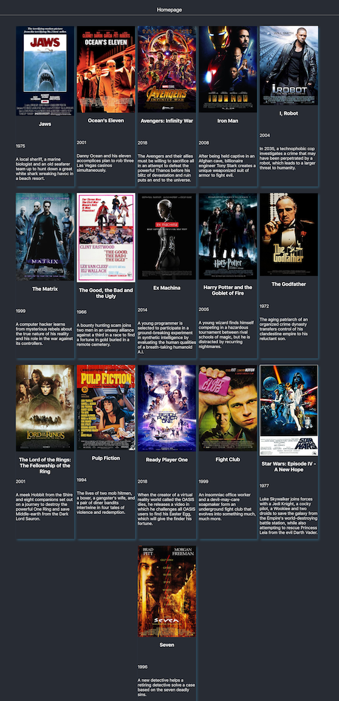

# Challenge React - Netflix

**Objective**: Create an app similar to Netflix with React

## Instructions

### Sprint 1 - Movies

[Link to repo](https://github.com/becodeorg/BXL-Johnson-2.5/tree/master/08-REACT/React-workshop-video/01-Movie-map)

We have two files:  
* App.css  
* movie.json

To do:   
1. Install react-dom-router and create homepage.js and showCard.js    
2. In homepage.js, button to direct to showCard   
3. In showCard, display movies with JavaScript  

### Sprint 2 - Filter

[Link to repo](https://github.com/becodeorg/BXL-Johnson-2.5/tree/master/08-REACT/React-workshop-video/02-Movie-filter)

To do: 
1. Create a file with an input 'text'
2. Handle user search with **states** and **props**
3. For every search, let's filter actors, title and year

#### Result

   

